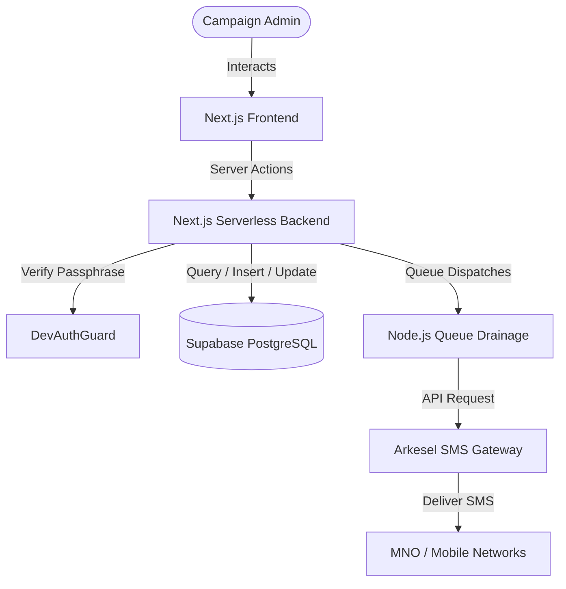

# Concord SMS Platform — System Documentation

## 1. Product Overview

Concord SMS is a premium, high-performance bulk campaign SMS and automated reminder management platform developed by **PhiNova**. Specifically tailored for political campaigns, electoral constituency coordinators, and community mobilizers, the platform streamlines the management of large voter/constituent databases, enables dynamic segmentation based on geography and role, and guarantees the asynchronous delivery of highly personalized text broadcasts.

### The Core Problem It Solves
Political campaigns and grassroots organizations typically manage member data across fragmented, messy Excel spreadsheets. These datasets suffer from severe data quality issues:
* **Inconsistent Labeling:** The same position might be spelled 50 different ways (e.g., `CHAIR`, `CHAIRPERSON`, `CHAIRMAN`, `W. ORG`).
* **Missing Contact Info:** Large chunks of records lack valid phone numbers or Voter IDs.
* **Duplicate Geographies:** Polling stations often share non-unique identifying codes.
* **Server Timeouts:** Sending standard bulk SMS to thousands of recipients simultaneously usually triggers serverless gateway timeouts.

Concord SMS resolves these challenges by automating spreadsheet parsing and role normalization, automatically flagging missing data, deduplicating polling station codes, and running a resilient server-side recursive worker queue to drain large SMS dispatches without timeouts.

### Target User / Organization [The current users and organizations that use Concord SMS]
* Local and national political party campaign teams (specifically optimized for campaigns like the New Patriotic Party (NPP) in Ghana).
* Parliamentary and municipal candidates (e.g., the **Rachael-RTK** campaign in Weija-Gbawe).
* Constituency organizers and district mobilizers.

---

## 2. Key Features

* **Dynamic Group Switcher & Filter Panel:** A multi-level contact segmentation panel that allows administrators to filter records instantly by electoral sub-area, canonical leadership role, polling station, or smart filters (e.g., "Contacts lacking phone numbers", "Missing Voter IDs").
* **Spreadsheet Import & Normalization Pipeline:** Powered by `SheetJS`, this script parses multi-sheet Excel workbooks (such as `MASTER DRYBONE.xlsx`), associates members with parent polling stations, resolves duplicate station codes (e.g., splitting `C021201` into `C021201-A` and `C021201-B`), and standardizes roles.
* **Campaign Composer & Personalization Engine:** A rich message composition interface featuring dynamic merge tags (e.g., `[Firstname]`, `[Position]`, `[Station]`), standard SMS character counting (160-character parts), and selectable pre-registered Sender IDs.
* **Live Mobile Previewer:** An interactive mock mobile phone UI that renders a live preview of the SMS exactly as it will appear to a selected recipient, resolving all merge tags dynamically.
* **Scheduled Reminders:** A calendar-scheduling system to configure automated, time-triggered SMS reminders (e.g., meeting alerts, registration reminders) targeted to specific constituents.
* **High-Volume Queue Simulation & Live Monitor:** A developer panel that simulates dispatching campaigns to thousands of mock recipients, featuring real-time progress indicators, wave counters, latency testing, and manual halt/abort signals.
* **White-Label Branding Settings:** A global configuration dashboard where administrators can customize the platform's primary/secondary colors, watermark logo, watermark opacity, and login page backgrounds.
* **Gateway Balance Diagnostic:** A live dashboard component that displays the current carrier balance and checks gateway API connection status.

### Integrations
1. **Arkesel SMS Gateway (v1 API):** A specialized telecom carrier gateway optimized for Ghana and West African telecommunications networks. It supports country-code phone normalization (automatically prepending the `233` country code and stripping leading zeroes or special characters) and dynamic Sender IDs.
2. **SheetJS (xlsx):** Used for client-side and server-side spreadsheet parsing and importing.
3. **Supabase Client SDK:** Direct real-time data persistence and Row-Level Security policy enforcement.

---

## 3. Technical Architecture

### Tech Stack
* **Frontend:** Next.js (App Router, Tailwind CSS, Lucide icons, Sonner toast notifications).
* **Backend:** Next.js Server Actions (running on Vercel Serverless Functions).
* **Database:** Supabase (PostgreSQL with custom functions, triggers, and indexes).
* **Auth:** Supabase Auth (session management and secure token signing).
* **Scheduler:** Local Node.js background recursive task scheduler + Supabase Edge Functions.
* **SMS Gateway:** Arkesel API.

### Hosting & Deployment Model
Concord SMS is deployed as a fully cloud-hosted platform:
* **Application Frontend & Backend:** Deployed on **Vercel** for high availability and automatic scaling of serverless actions.
* **Database & Edge Functions:** Deployed on **Supabase Cloud**.
* **Offline Capability:** The platform operates purely online. An active internet connection is required to communicate with Supabase, verify sessions, and route messages to the Arkesel gateway.

### Security and Data Privacy Measures
* **Row-Level Security (RLS):** Enabled on all core tables (`profiles`, `contacts`, `templates`, `messages`, `scheduled_reminders`). Standard users can only view, create, or modify records linked directly to their user accounts.
* **Column-Level Security (CLS) on System Settings:** Public access is strictly limited. Standard roles are granted `SELECT` access only on non-sensitive styling parameters (`primary_color`, `secondary_color`, `watermark_url`, `watermark_opacity`), and `UPDATE` privileges are limited to authenticated staff.
* **Developer Portal Shielding:** The developer configurations are protected by a server-verified passphrase through `DevAuthGuard`.
* **Exponential Lockout Policy:** The developer portal enforces a strict session-based lockout after 5 consecutive incorrect passphrase attempts. The lockout duration starts at 30 seconds and doubles exponentially with each subsequent cycle (30s $\rightarrow$ 60s $\rightarrow$ 120s $\rightarrow$ 240s) to prevent brute-force attacks.

---

## 4. User Roles & Access

The platform supports two distinct user roles defined in the `profiles` schema:

| Feature/Access | Administrator (Admin) | Staff / Campaign User |
|----------------|:---------------------:|:---------------------:|
| **RLS Restrictions** | Bypassed (via Service Role) | Enforced (Self-owned records only) |
| **Contacts Management** | View, Edit, and Delete All | View and Edit Own Contacts |
| **SMS Campaign Sending** | Send to All / Any Group | Send to Own Groups Only |
| **Branding Settings** | Full Update Access | Read-Only |
| **Developer Portal** | Allowed (with Passphrase) | Strictly Blocked |
| **Simulation & Diagnostics** | Full Control (Queue Halt/Clean) | Blocked |

---

## 5. Modules & Product Tiers

This structure directly informs the commercial pricing packages for the Concord platform:

### 1. Basic Tier (Standard Outreach)
Designed for small campaigns or local candidates who only need basic contact storage and broadcast tools.
* **Contact Directory:** Standard contact registry (manual creation, no bulk Excel import).
* **Broadcast Engine:** Standard campaign sender (no custom templates or dynamic personalization merge tags).
* **Default Sender ID:** Generic platform routing.
* **Standard Analytics:** Simple counts of sent vs. failed messages.

### 2. Advanced Tier (Targeted Campaigning) — *Recommended*
Built for competitive parliamentary campaigns and constituency teams requiring geographic and role-based mobilization.
* **Spreadsheet Import Pipeline:** Access to the SheetJS parsing engine for imports like `MASTER DRYBONE.xlsx`.
* **Standardized Role Mapper:** Automatic grouping of 50+ role variations into 7 clean categories.
* **Dynamic Group Switcher:** Multi-tab geographic filtering (Sub-Area $\rightarrow$ Station $\rightarrow$ Role).
* **Personalized Broadcasts:** Unlimited merge tags (`[Firstname]`, `[Position]`, etc.) with Live Mobile Preview.
* **Scheduled Reminders:** Automated SMS scheduler linked to meetings and events.

### 3. Enterprise / White-Label Add-on (Optional Customization)
For political parties or national campaigns wishing to scale the software across multiple constituencies under their own branding.
* **Platform Customization:** Portal styling configuration (custom brand colors, candidate background screens, watermark overlays).
* **Custom Sender IDs:** Dedicated registration and verification of custom campaign Sender IDs (e.g., `Rachael-RTK`, `RTK4SERVICE`).
* **High-Volume Queue Worker:** Access to the high-throughput server-side recursive batch scheduler (draining campaigns of 10,000+ contacts).

---

## 6. Current Usage & Clients

Concord SMS is currently in active deployment:
* **Primary Beta Client:** The **Weija-Gbawe Constituency NPP Campaign Team** in Accra, Ghana.
* **Scale of Deployed Database:** **1,495 constituent records** loaded across **13 sub-areas** (including Gbawe West, New Weija East/West, Mallam East/West, Tetegu, Gonse, Oblogo, McCarthy North/South, Djaman, and New Gbawe).
* **SMS Readiness:** **1,328 contacts** are validated and ready to receive SMS (167 records are flagged as missing phone numbers).

### Client Testimonials & Feedback
> "The Excel normalization mapper is a lifesaver. Before Concord, we spent days correcting spelling mistakes for local coordinators in Weija. Now, the system handles the import automatically, and we can summon all 13 sub-area chairmen to a emergency meeting in three clicks."  
> — *Campaign Coordinator, Weija-Gbawe NPP*

> "The personalized templates make a massive difference. When a coordinator receives an SMS addressed to them as 'Chairman [Lastname]' instead of a generic text, they are far more likely to show up for mobilization events. The mobile preview ensures we never send broken tags."  
> — *Communications Director*

---

## 7. Support & Onboarding

To guarantee a seamless launch for new campaign teams, PhiNova offers a structured onboarding and support package:

### Client Onboarding Process
1. **Infrastructure Provisioning (Day 1):** We deploy a dedicated Next.js application container on Vercel and set up a secure PostgreSQL schema in Supabase.
2. **Data Import & Quality Audit (Day 2-3):** The client provides their Excel directory. We run the `importDrybone` pipeline to clean the contacts, resolve duplicate station codes, and deliver a detailed Data Quality Report showing missing phone numbers and voter IDs.
3. **Sender ID Pre-Registration (Day 3-5):** We coordinate with the client to register their custom Sender IDs (e.g., `Rachael-RTK`) directly with Arkesel and local telecommunication networks to prevent spam filtering.
4. **Branding Configuration (Day 5):** We configure the portal's custom brand colors, watermarks, and login wallpapers to match the candidate's campaign materials.

### Training & Support Channels
* **In-App Documentation:** Complete interactive user guides detailing template management and reminder scheduling.
* **Interactive Training:** A 1-hour screen-share session walking campaign staff through contact filtering, selecting recipients, and reviewing the live SMS preview.
* **Direct Election Support:** Dedicated WhatsApp/Telegram channel with PhiNova engineers for real-time troubleshooting and gateway balance management during active election windows.
* **Gateway Status & Auto-Alerts:** In-app visual notifications monitoring gateway connection online status and SMS credit levels.
